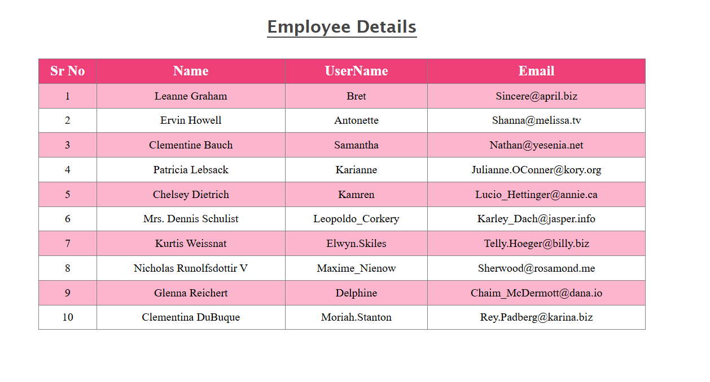

# PR-1-USEEFFECT

A simple **React + Vite** project demonstrating the usage of the **`useEffect` hook** by fetching and displaying employee data in a styled table.

---

## 📸 Project Preview



The application displays **Employee Details** in a table format with:

* Serial Number
* Name
* Username
* Email

The UI uses alternating row colors and a highlighted header for better readability.

---

## 🚀 Features

* Built with **React (Vite)**
* Demonstrates **`useEffect` lifecycle behavior**
* Employee data fetched using **API (Data Fetching)**
* Displays dynamic data in a table
* Clean and simple table UI
* Beginner-friendly project structure

---

## 🧠 Concepts Used

* `useState`
* `useEffect`
* API Fetching using `fetch()`
* Handling asynchronous data
* Component-based structure
* JSX
* Basic CSS styling

---

## 📁 Project Structure

```
PR-1-USEEFFECT
│
├── public
├── src
│   ├── assets
│   ├── App.jsx
│   ├── index.css
│   └── main.jsx
│
├── index.html
├── package.json
├── vite.config.js
├── eslint.config.js
├── yarn.lock
└── README.md
```

---

## 🛠️ Installation & Run

1. Clone the repository

```bash
git clone https://github.com/devanshi78/PR-1-UseEffect
```

2. Install dependencies

```bash
npm install
```

3. Start development server

```bash
npm run dev
```

---

## 🎯 Learning Purpose

This project is created for:

* Practicing **React hooks**
* Understanding **component mounting and updating**
* Preparing for **web development competitions / practical exams**

---

## 🙌 Author

**Devanshi Parekh**
Frontend Learner | React Beginner